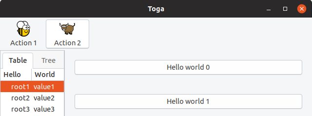
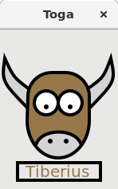

## 5 Steps to Build Python Native GUI Widgets for

# 

---

BeeWare is

Software libraries for cross-platform native app development from a single Python codebase

and

Tools to simplify app deployment

---

# Hello World

```python
import toga


class HelloWorld(toga.App):
    def startup(self):
        self.main_window = toga.MainWindow(title=self.name)
        main_box = toga.Box()
        self.main_window.content = main_box
        self.main_window.show()


def main():
    return HelloWorld('Hello World', 'org.pybee.helloworld')
```
---
# Current Status

* Solid proof of concept
* Open Source (BSD)
* 400+ contributors

---

# Toga Widget

* The controls and logic that a user interacts with when using a GUI

# 

* A Canvas widget will be used as an example

---
# Internal layers

* The **Interface** layer

* The **Implementation** layer

* The **Native** layer
---
<section data-background="/images/toga-architecture.svg" data-background-size="contain">
</section>
---

# Step 0
## development platform
* Normally pick the platform that you are most familiar with
* macOS and Gtk+ are the most developed 👍
* Is this a mobile only widget (camera, GPS, etc)?

---

# Step 1
## Research your widget
* How do you create this widget on different platforms
* Think, brainstorm, whiteboard, and discuss how you would want to create and manipulate this widget with Python

---
## Research your widget

Tkinter

```Python
canvas = Tk.Canvas()
canvas.create_rectangle(10, 10, 100, 100, fill="C80000")
canvas.pack()
```
wxpython

```Python
wx.Panel.Bind(wx.EVT_PAINT, OnPaint)
def OnPaint(self, evt)
    dc = wx.PaintDC()
    dc.SetBrush(wx.Brush(wx.Colour(200, 0, 0))
    dc.DrawRectangle(10, 10, 100, 100)
```
---

## Research your widget
HTML canvas

```javascript
var c = document.getElementById("myCanvas");
var ctx = c.getContext("2d");
ctx.fillStyle = "rgb(200, 0, 0)";
ctx.fillRect(10, 10, 100, 100);
```

Gtk+

```Python
drawingarea = Gtk.DrawingArea()
drawingarea.connect("draw", draw)
def draw(da, ctx):
    ctx.set_source_rgb(200, 0, 0)
    ctx.rectangle(10, 10, 100, 100)
    ctx.fill()
```
---

# Step 2

## Interface layer: Pythonic API
* Write your API documentation first
* The API provides the set of clearly defined methods of communication (layers) between the software components
* Documentation Driven Development
* This is iterative with Step 1

---
## Write Docs
```md
The canvas is used for creating a blank widget that you can
draw on.

Usage
-----

Simple usage to draw a colored rectangle on the screen using
the arc drawing object:

import toga
canvas = toga.Canvas(style=Pack(flex=1))
with canvas.fill(color=rgb(200, 0, 0) as fill:
    fill.rect(10, 10, 100, 100)
```
---
## Write Code Outline
```Python
class Canvas(Context, Widget):
    """Create new canvas.

    Args:
        id (str):  An identifier for this widget.
        style (:obj:`Style`): An optional style object. 
        factory (:obj:`module`): A python module that is
            capable to return a implementation of this class.
            
     """
```

```Python
def rect(self, x, y, width, height):
    """Constructs and returns a :class:`Rect <Rect>`.

    Args:
        x (float): x coordinate for the rectangle.
    """
```

---

# Step 3

## Implement Toga_core
### (with TDD)

* Write a test for each function of the widget outlined in the API from Step 3
* Check that the tests fail
* Specify the implementation layer API
* Write the core code for the widget to call the implementation layer

---

## Write tests for Toga_core

```Python
def test_widget_created():
    assertEqual(canvas._impl.interface, canvas)
    self.assertActionPerformed(canvas, "create Canvas")
```

```Python
def test_rect_modify():
    rect = canvas.rect(-5, 5, 10, 15)
    rect.x = 5
    rect.y = -5
    rect.width = 0.5
    rect.height = -0.5
    canvas.redraw()
    self.assertActionPerformedWith(
    	    canvas, "rect", x=5, y=-5, width=0.5, height=-0.5
        )
```

---

## Code toga_core

```Python
Class Canvas(Widget):
    def __init__(self, id=None, style=None, factory=None):
        super().__init__(id=id, style=style, factory=factory)

        # Create a platform specific implementation of Canvas
        self._impl = self.factory.Canvas(interface=self)
    
    def rect(self, x, y, width, height):
        self.impl.rect(
            self.x, self.y, self.width, self.height
        )
```

---
# Step 4
## Implement Toga_impl
### dummy backend

* Dummy is for automatic testing without a native platform
* Code the implementation layer API endpoint, create a method for each call of the API
* Check that all tests now pass
---
## Implement Toga_impl
### dummy backend

```Python
class Canvas(Widget):
    def create(self):
        self._action("create Canvas")
        
    def rect(self, x, y, width, height):
        self._action(
            "rect", x=x, y=y, width=width, height=height
        )
```

---

# Step 5
## Implement Toga_impl
### your platform

* Copy toga_dummy and create a new endpoint for the platform you chose in Step 1
* Make use of the native interface API for this widget on your platform

---

## Implement Toga_impl
### your platform

```Python
class Canvas(Widget):
    def create(self):
        self.native = Gtk.DrawingArea()
        self.native.interface = self.interface
    	self.native.connect("draw", self.gtk_draw_callback)
    
    def gtk_draw_callback(self, canvas, gtk_context):
        self.interface._draw(self, draw_context=gtk_context)

    def rect(self, x, y, width, height, draw_context):
        draw_context.rectangle(x, y, width, height)
```

---
#   
## Submit a pull request!  
  
## 🎉👍💖

---

@danyeaw  
  
github.com/danyeaw  
  
dan.yeaw.me  
  
linkedin.com/in/danyeaw  
  
dan@yeaw.me  

---
