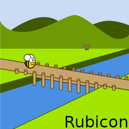
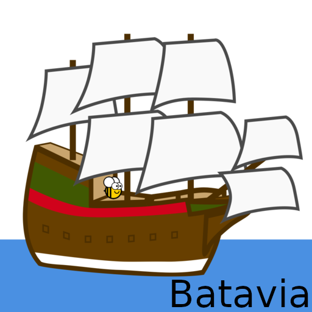
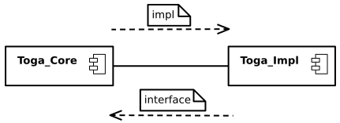

## 5 Steps to Build Python Native GUI Widgets for

<!-- .element style="border: 0; box-shadow: None" -->

Notes:

Hi my name is Dan Yeaw. I work for Ford Motor Company where I help
design safety in to complex software-based automated and electrified
technologies. In my free time, I have been working on an open source tool
used to model these complex system designs.

Eventually I got really frustrated with the current set of GUI toolkits
that are available for Python. I want the ability to write an app once
and have it look and feel great on all of my devices, but instead I was
dealing with toolkits that are wrapped or introspected around C or C++
libraries, or visually look like a blast from past. They made me feel like I 
was going against the grain of Python instead of writing great Pythonic code.

I am currently a core contributor to the BeeWare project, and I am so excited
to talk to you about 5 Steps to Build Python Native GUI Widgets for BeeWare.
---

BeeWare is

### Cross-platform
### Native
### App development
### with Python

and

### Simple app deployment

---
# Toga
## Beeware's GUI Toolkit

<!-- .element style="border: 0; box-shadow: None" -->

Notes:

Solid proof of concept
Creating a simple app on macOS, Linux, or iOS is definitely possible.

This alpha status may not be so exciting for you if you are just trying to
build an app, but I think it is very exciting for those that want to
contribute to an open source project. Although there are many ways to get
involved, users keep asking how they can build a GUI widget that isn't yet
supported. I think this is a great way to make a significant contribution.

---

# Hello World

<!-- .element style="border: 0; height: 500px; box-shadow: None" -->

Notes:
import toga

class HelloWorld(toga.App):
    def startup(self):
        self.main_window = toga.MainWindow(title=self.name)
        main_box = toga.Box()
        self.main_window.content = main_box
        self.main_window.show()

def main():
    return HelloWorld('Hello World', 'org.pybee.helloworld')

---

# Background

A widget is the controls and logic that a user interacts with when using a GUI

<!-- .element style="border: 0; box-shadow: None" -->

A Canvas widget will be used as an example

---

# Toga Blackbox

<!-- .element style="border: 0; box-shadow: None" -->

---

# Bridge or Transpiler

<!-- .element style="border: 0; box-shadow: None" -->

<!-- .element style="border: 0; box-shadow: None" height="256" -->

<!-- .element style="border: 0; box-shadow: None" height="256" -->

---

# Toga Whitebox

<!-- .element style="border: 0; box-shadow: None" -->

---

# More Terms

<!-- .element style="border: 0; box-shadow: None" -->

---

# Toga_Impl Factory Pattern

<!-- .element style="border: 0; box-shadow: None" -->

---

# Step 0
## development platform
* Normally pick the platform that you are most familiar with
* macOS and GTK are the most developed 👍
* Is this a mobile only widget (camera, GPS, etc)?

---

# Step 1
## Research your widget
* Abstraction requires knowledge of specific examples
* Create use cases or user stories
* Get feedback

---
## Research your widget
Tkinter

<!-- .element style="border: 0; box-shadow: None" -->

Notes:
import tkinter as tk

root = tk.Tk()
canvas = tk.Canvas()
canvas.create_rectangle(10, 10, 100, 100, fill="red")
canvas.pack()
root.mainloop()

4 Steps:
Create, Configure, Pack, and Bind

---

## Research your widget
GTK

<!-- .element style="border: 0; box-shadow: None" -->

Notes:
drawingarea = Gtk.DrawingArea()
drawingarea.connect("draw", draw)
def draw(da, ctx):
    ctx.set_source_rgb(200, 0, 0)
    ctx.rectangle(10, 10, 100, 100)
    ctx.fill()

---

##  Research your widget
Use Cases

<!-- .element style="border: 0; box-shadow: None" -->

---

# Step 2

## Write Docs
* Write your API documentation first
* The API provides the set of clearly defined methods of communication (layers) between the software components
* Documentation Driven Development
* This is iterative with Step 1

---
## Write Docs

<!-- .element style="border: 0; box-shadow: None" -->

Notes:
The canvas is used for creating a blank widget that you can
draw on.

## Usage

An example of simple usage is to draw a colored rectangle on
the screen using the `rect` drawing object:

import toga
canvas = toga.Canvas(style=Pack(flex=1))
with canvas.fill(color=rgb(200, 0, 0)) as fill:
    fill.rect(10, 10, 100, 100)

---
## Write Code Outline / Docstrings

<!-- .element style="border: 0; box-shadow: None" -->

Notes:
class Canvas(Widget):
    """Create new canvas.

    Args:
        id (str):  An identifier for this widget.
        style (:obj:`Style`): An optional style object. 
        factory (:obj:`module`): A python module that is
            capable to return a implementation of this class.
            
     """

---

# Step 3

## Implement Toga_core
### (with TDD)
* First write tests for Toga_core
* Then code the outline created in Step 2

---

## Write tests for Toga_core

<!-- .element style="border: 0; box-shadow: None" -->

Notes:
def test_widget_created():
    assertEqual(canvas._impl.interface, canvas)
    self.assertActionPerformed(canvas, "create Canvas")

---

## Write tests for Toga_core

<!-- .element style="border: 0; box-shadow: None" -->

Notes:
def test_rect_modify():
    rect = canvas.rect(-5, 5, 10, 15)
    rect.x = 5
    rect.y = -5
    rect.width = 0.5
    rect.height = -0.5
    canvas.redraw()
    self.assertActionPerformedWith(
    	    canvas, "rect", x=5, y=-5, width=0.5, height=-0.5
        )

---

## Code toga_core

<!-- .element style="border: 0; box-shadow: None" -->

Notes:
class Canvas(Widget):
    def __init__(self, id=None, style=None, factory=None):
        super().__init__(id=id, style=style, factory=factory)

        # Create a platform specific implementation of Canvas
        self._impl = self.factory.Canvas(interface=self)
    
    def rect(self, x, y, width, height):
        self.impl.rect(
            self.x, self.y, self.width, self.height
        )

---
# Step 4
## Implement Toga_impl
### dummy backend

* Dummy is for automatic testing without a native platform
* Code the implementation layer API endpoint, create a method for each call of the API
* Check that all tests now pass
---
## Implement Toga_impl
### dummy backend

<!-- .element style="border: 0; box-shadow: None" -->

Notes:
class Canvas(Widget):
    def create(self):
        self._action("create Canvas")
        
    def rect(self, x, y, width, height):
        self._action(
            "rect", x=x, y=y, width=width, height=height
        )

---

# Step 5
## Implement Toga_impl
### your platform

* Copy toga_dummy and create a new endpoint for the platform you chose in Step 1
* Make use of the native interface API for this widget on your platform

---

## Implement Toga_impl
### your platform

<!-- .element style="border: 0; box-shadow: None" -->

Notes:
class Canvas(Widget):
    def create(self):
        self.native = Gtk.DrawingArea()
        self.native.connect("draw", self.gtk_draw_callback)
    
    def gtk_draw_callback(self, canvas, gtk_context):
        self.interface._draw(self, draw_context=gtk_context)

    def rect(self, x, y, width, height, draw_context):
        draw_context.rectangle(x, y, width, height)

---

## Implement Toga_impl
### other platforms

<!-- .element style="border: 0; box-shadow: None" -->
    
Notes:
class TogaCanvas(NSView):
    @objc_method
    def drawRect_(self, rect: NSRect) -> None:
        context = NSGraphicsContext.currentContext.graphicsPort()

class Canvas(Widget):
    def create(self):
        self.native = TogaCanvas.alloc().init()

    def rect(self, x, y, width, height, draw_context, *args, **kwargs):
        rectangle = CGRectMake(x, y, width, height)
        core_graphics.CGContextAddRect(draw_context, rectangle
---

# Iterate
### Iterate through steps 1-5 to complete your widget implementation

---

## Submit a pull request!  
  
#   
## 🎉👍💖

---

# Summary
1. Research Your Widget
2. Write Docs
3. Toga_core
4. Toga_impl - Dummy Backend
5. Toga_impl - Your Platform

---

@danyeaw  
  
github.com/danyeaw  
  
dan.yeaw.me  
  
linkedin.com/in/danyeaw  
  
dan@yeaw.me  
