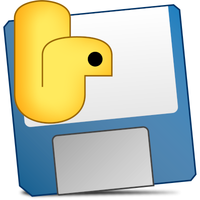
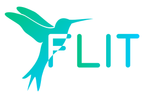
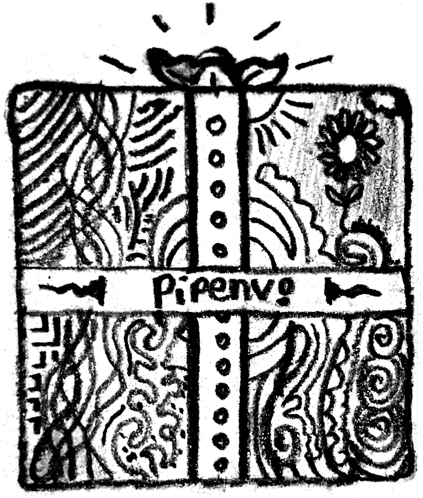
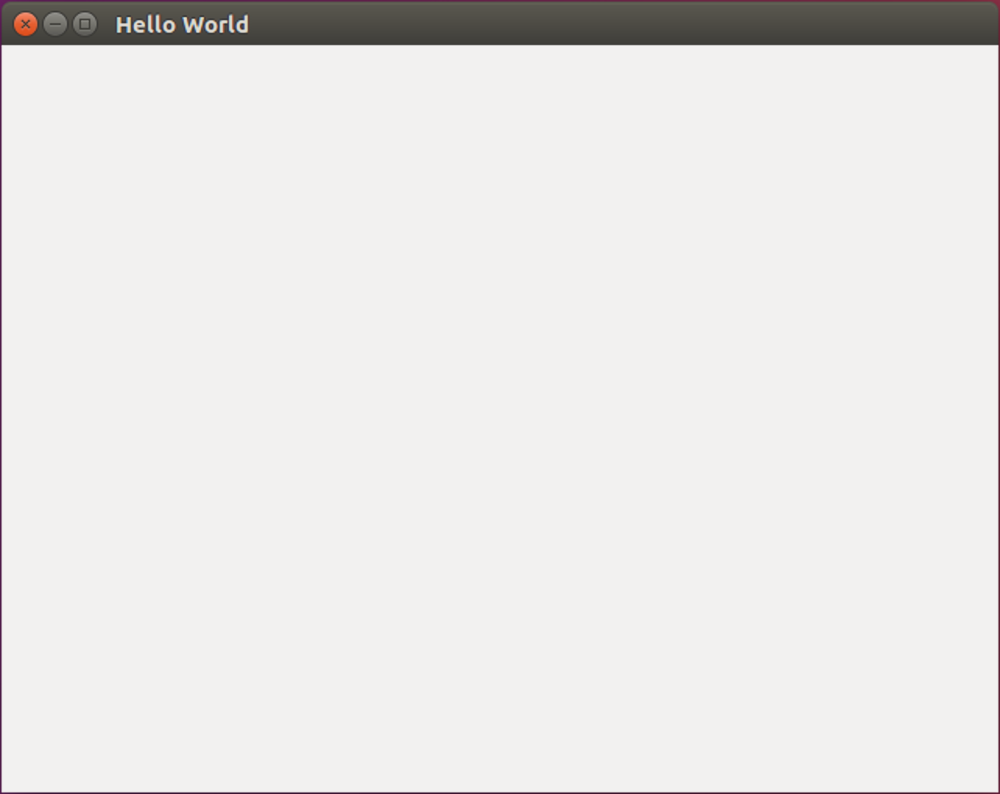

## How to Rock Python Packaging with Poetry and Briefcase

---

# Background

---

## Packaging Use Cases

Two main uses cases for packaging:
1. Library
2. Application

---

## Library Packaging

Goal: Get it on PyPI so that other projects can `pip install` it.

The standard format to achieve this is the Wheel which contains:
1. The built distribution
2. Metadata

Result: fast installation using `pip`

---

## Config Files for Libraries

Previously, there was 4 config files needed:
1. setup.py - The setup script for building, distributing and installing
  modules using the Distutils.
2. requirements.txt - Allow easy install of requirements using `pip install -r`
3. setup.cfg - The setup configuration file
4. MANIFEST.in - The manifest template, directs sdist how to generate
  a manifest

---

## Application Packaging

Goal: Get it in formats that can be distributed to the different platforms.

Previously, there was a whole host of tools to do this like py2exe, p2app,
cx_Freeze, PyInstaller, and rumps.

# 

---

## PEP 518 - pyproject.toml

The pyproject.toml replaced those four configuration files above using two main
sections:

1. `[build-system] ` - Min requirements for the build system to execute.
2. `[tool]` - Tools can have users specify configuration data.



---

## Pipenv and the Lockfile

Aims at managing virtualenvs and dependencies for Python Applications
including a lock file that:
- Contains exact version of every dependency
- Key output for an Application: repeatible builds



---

## Poetry Makes it Easy

Poetry combined some of the ideas from flit and Pipenv, to make something even better.

- Uses pyproject.toml
- Includes a lock file (poetry.lock)
- Automatic virtualenvs
- Exhaustive dependency resolution

---

## Briefcase

Distribute your program as a native application to:
Windows | Linux | macOS | iOS | Android | Django

### 

---

# Tutorial

---

### Initial Tool Installation

Install cookiecutter, the Python project template tool:
```bash
$ pip install cookiecutter
```

Install Poetry:
```bash
$ curl -sSL https://raw.githubusercontent.com/sdispater/poetry/master/get-poetry.py | python
```
---

### TestPyPI Account Sign-Up

Register for an account on
[TestPyPI](https://test.pypi.org/account/register/)

PyPI Sandbox

---

### Create Your Project

To create the Python project, we are going to use the Briefcase template, so
run `cookiecutter` on this template:
```bash
$ cookiecutter https://github.com/pybee/briefcase-template
```
Interactive: enter name, description, and select software license

```bash
$ cd dantestapp
$ git init
$ git add .
```

---

### Create a pyproject.toml Configuration

```bash
$ poetry init

Package name [dantestapp]: 
Version [0.1.0]: 
Description []: 
Author [Dan Yeaw <dan@yeaw.me>, n to skip]: 
License []: MIT
Compatible Python versions [^3.7]: 
```

---

### Create a pyproject.toml Configuration
#### Define Dependencies
The configuration generator then asks for you to define your dependencies:
```bash
Would you like to define your dependencies (require)
interactively? (yes/no) [yes]

Search for package: briefcase

Found 2 packages matching briefcase

Enter package:
 [0] briefcase
 [1] django-briefcase
```

---

### Create a pyproject.toml Configuration
#### Define Development Dependencies

```bash
Would you like to define your dev dependencies (require-dev)
interactively (yes/no) [yes]

Search for package: pytest

Found 100 packages matching pytest

Enter package: 
 [ 0] pytest
```
---

### Create a pyproject.toml Configuration
#### Complete the Configuration

```bash
[tool.poetry]
name = "dantestapp"
version = "0.1.0"
description = ""
authors = ["Dan Yeaw <dan@yeaw.me>"]
license = "MIT"

[tool.poetry.dependencies]
python = "^3.7"
briefcase = "^0.2.8"
toga = "^0.2.15"

[tool.poetry.dev-dependencies]
pytest = "^4.0"

[build-system]
requires = ["poetry>=0.12"]
build-backend = "poetry.masonry.api"
```
Notice that Poetry makes use of ^ and ~ requirements.

---

### Install Dependencies

```bash
$ poetry install
```

---

### Automatic Virtual Environment

The virtualenv was automatically created, to see where run:
```bash
$ poetry show -v
or
$ poetry config --list
```

---

### Bundle and Run your Application for Platform Distribution

Briefcase allows you to package and run your app using your platform:

```bash
(Windows) $ poetry run python setup.py windows -s
(macOS)   $ poetry run python setup.py macos -s
(Linux)   $ poetry run python setup.py linux -s
```
Your app be packaged and then launch.

### 

---

### Build your Library for Distribution on PyPI

```bash
$ poetry build

Building dantestapp (0.1.0)
 - Building sdist
 - Built dantestapp-0.1.0.tar.gz

 - Building wheel
 - Built dantestapp-0.1.0-py3-none-any.whl
```

The source distribution (sdist) and wheel are now in a new `dist` folder.

---

### Publish your Library top PyPI

Add the TestPyPI repository to Poetry:
```bash
$ poetry config repositories.test-pypi https://test.pypi.org/legacy/
```
Now simply run:
```bash
$ poetry publish -r test-pypi
```
Congrats! Your package is now available to be viewed at
https://test.pypi.org/project/your-project-name/ and can be pip installed:
```bash
pip install -i https://test.pypi.org/simple/ your-project-name
```
---

# Summary and Questions

---

@danyeaw  
  
github.com/danyeaw  
  
dan.yeaw.me  
  
linkedin.com/in/danyeaw  
  
dan@yeaw.me  
